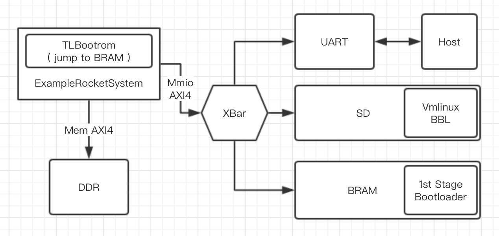
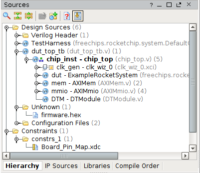
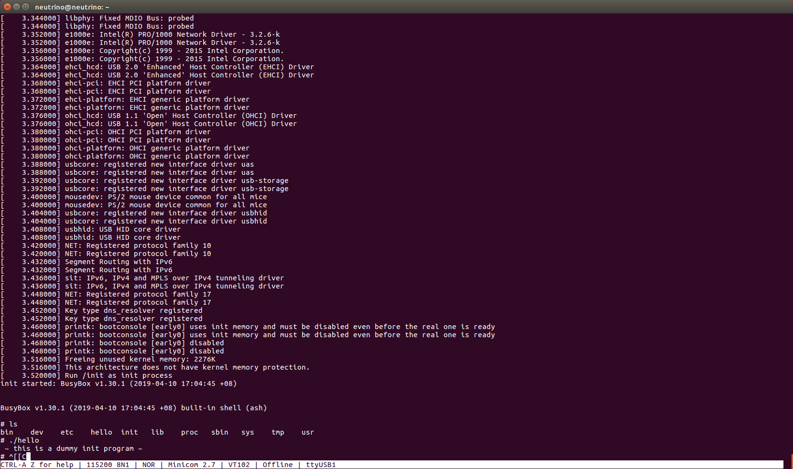
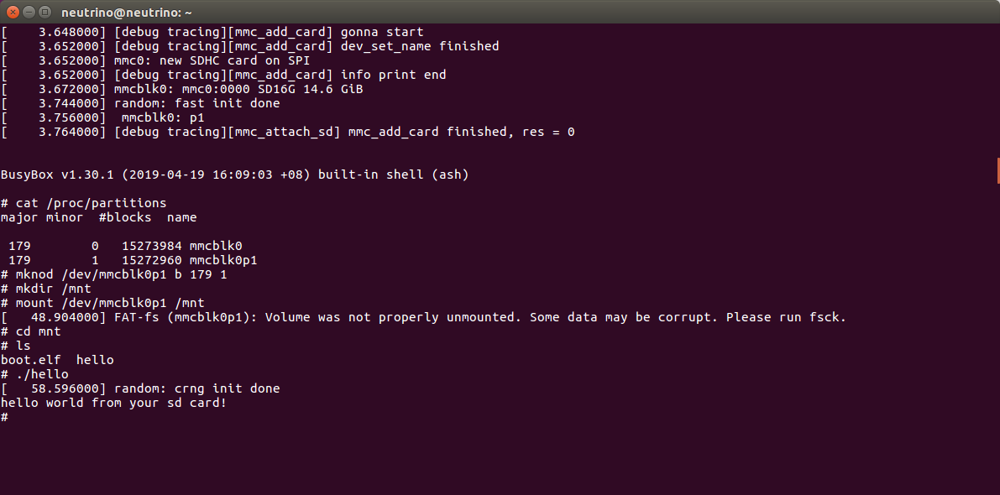

# Step-by-step Guide of Booting linux on a Rocket-chip SoC on Nexys4ddr

### Other Interesting Proejcts

- In the original implementation, debug module is grounded. If you are interested in using GDB (either through PMOD or BSCAN to connect JTAG), you might want to look into [this repo](https://github.com/thomascp/fpga-rocket-chip/tree/nexys-jtag) by thomascp.

### STEPS OVERVIEW

- generate FPGA configuration file, i.e. ***.mcs**
  - DefaultConfig.v / firmware.hex
  - vivado project
  - *.mcs
- build linux kernel file, i.e. **vmlinux**
  - busybox / inittab
  - rootfs.cpio
  - vmlinux
- build the sd_image, i.e. **boot.elf**
- on board test

## I. Big Map

The main idea of this guide is to provide a step-by-step tutorial of building a **RISC-V** SoC, especially for those who are interested in **Rocket-chip** and want to test it on a real board instead of simulators. At the end of this tutorial, you will be able to boot a Linux on  **Nexys4ddr** FPGA board and run your own riscv programs on it.

A general background is provided by the following links: [RISC-V](https://riscv.org) and [Rocket-Chip](https://github.com/freechipsproject/rocket-chip).

### 1.1 How a Linux gets booted

The **ExampleRocketSystem** generated by Rocket-chip is the main module that we will adopt to build our system. It exposes a MIMO-AXI4 and a Mem-AXI4 interfaces to those outside peripherals, of which the former will be connected to IO devices including **Uart**(@0x60000000), **SDslot**(@0x60020000) and **BRAM_64K**(@0x60010000) and the latter will be used to connect **DDR**(@0x80000000) memory.

Here is the whole story of linux booting procedure: 

- After power on, PC (program counter) is set to 0x10040 according to the variable **Reset_Vector**. The processor starts executing instructions in **TLBootrom**(@0x10000) inside of ExampleRocketChip. TLBootrom contains instrcutions asking the processor jumping to BRAM_64K: 
  - `li s0, BRAM_BASE`, ` jr s0` ( /rocket-chip/bootrom.S )
- In **BRAM_64K**, two tasks of our **first stage bootloader** (aka FSBL) are accomplished: to copy the elf image, which contains a **BBL** (Berkeley bootloader) and a **vmlinux** image, to a certain address (@0x870000000) in the DDR, and to extract this elf onto the beginning of DDR(@0x80000000). Following the two tasks, FSBL will jump to DDR and PC will move to the bbl program:  
  - `li s0, DDR_BASE`, ` jr s0` ( /firmware/head.S )
- In DDR, BBL will do some preparation works, including setting traps, SBI (supervisor binary interface) and physical memory protection. Then handing over a DTB (device tree blob) to the kernel (in early versions, BBL also virtualizes the memory, which is now directly handled by the Linux). Ultimately, BBL starts the Linux kernel:
  - `enter_supervisor_mode(entry, hartid, dtb_output())` ( /riscv-pk/bbl/bbl.c )
- After the initialization of the kernel, **busybox_init** starts and calls the **busybox_ash**, which provides you with a command line interface.

### 1.2 Prerequisites

You should know the followings before continue to the next section.

- how to use and read the GNU Makefiles
- how to compile C/C++ using GNU GCC
- C and Assembly language
- Basic knowledge of compiling a Linux kernel
- Some experience in designing hardware using Verilog/SystemVerilog

### 1.3 Preparing the Project

Download source files:

`git clone --recursive https://github.com/cnrv/fpga-rocket-chip`

`git submodule update --init --recursive`

There are several folders in the repo:

- **constraints**, **verilog**, **firmware** - These are sources that we will use to build the Vivado project and the FPGA configration file, namely, mcs. Firmware contains the SDloader program (firmware.hex) which loads an elf image into DDR, functioning as an FSBL. It will be burned into BRAM_64K.
- **riscv-pk** - a modified version of [riscv/riscv-pk](https://github.com/riscv/riscv-pk) repo.  BBL together with linux kernel will be put into SDcard and get loaded to DDR by FSBL. **NOTICE:** We implant the DTB into the bbl and slightly change the uart driver. Generally DTB should be located in the firmware but, for debugging convenience (it is time-consuming to change the firmware and reburn it into FPGA), I put it just inside the bbl. DTS is located at riscv-pk/build.
- **rocket-chip** - the official [freechipsproject/rocket-chip](https://github.com/freechipsproject/rocket-chip) repo. Our makefile will replace its **/rocket-chip/bootrom** with **/firmware/TLBootrom** automatically, so that the CPU can jump to **BRAM_64K** once it is powerd on.
- **pics** - pictures for this markdown file.
- in the following parts of this guide, path starting with "**/**" refers to path under this repo, fpga-rocket-chip.

Besides, you also need to download the following repos:

- **cross compiler** - `git clone https://github.com/riscv/riscv-gnu-toolchain` 
  - hash c2857f9c03867f9fe9ee8e44b7cf57dd83020455 by Kito Cheng <kito.cheng@sifive.com> Fri Sep 30 01:09:58 2022 +0800
    Newer version might work.
  - install **elf-gcc and** **linux-gcc** and set **RISCV** variable in advance
- **linux kernel** -  ` git clone https://github.com/riscv/riscv-linux` 
  - hash 8fe28cb58bcb235034b64cbbb7550a8a43fd88be by Linus Torvalds <torvalds@linux-foundation.org> Sun Dec 23 15:55:59 2018 -0800.
    Newer version should also work.
- **busybox** that provides init and utils - `git clone https://github.com/mirror/busybox` 
  - version 1.30 stable.
    Newer version should also work.

## II. Hardware generation 

**Vivado** version 2016.4/2018.03; **Ubuntu** version 16/18 LTS

The tutorial should work well for most version of Vivado.

### 2.1 building the Vivado project

Once you have the cross-compiler compiled and setup and the Vivado software available, the easiest way to create a Vivado project is:

~~~bash

make vivado

~~~

Which should set everything up and open the Vivado GUI. If this fails, follow the instructions below:

**The location of some files have been changed for more straight forwarding make procedure. See MakeFile for more details.**
~We will modify this README accordingly soon if we get time around. Stay tuned.~

#### 2.1.1 generate source files

- `cd fpga-rocket-chip`
- `make vivado_source`
- then you should get **firmware.hex** and **DefaultConfig.v** under /verilog directory.
- together with other verilog files, they are the source files used to build Vivado project.

#### 2.1.2 new project wizard

- Creat New Project 
- Add Sources - Add Directories - choose **/verilog**
- Add Constraints - Add Files - choose **/constraints/nexys4ddr.xdc**
- Default Part - Parts - choose **xc7a100tcsg324-1** , this is the chip that nexys4ddr holds.
- In the **Project Manager** window, right click **chip_inst - chip_top (chip_top.v)** and set it as Top module
- Please check if **firmware.hex** has been added as source file. It should be listed under **unknown file** category, like the screen shot:
  - 
  - If there is no **firmware.hex**, please add it manually by right click in the source window and choose **Add Sources ...** , select our **firmware.hex** generated in **2.1.1** . If you cannot fine **firmware.hex** in the **Add Source Files** window, try to change **Files of type**, which locates at the bottom of the window, to **All Files**. 
  - *VERY IMPORTANTLY*, once you find it under the **unknown type**, right click it and choose **Set File Type ...** select **Memory File**. After this, you will see **firmware.hex** under the category of **Memory File**.

#### 2.1.3 Adding Peri IPs

Before I output the TCL script (one of my future work),  at current stage please add those ips manually. Here's the configuration list.

**a) clocking wizard** 

- Component name - clk_wiz_0
- Clocking Options - Primitive - **PLL**
- Output Clocks - Output Clock - **clk_out1 50.000; clk_out2 200.000**
- Output Clocks - Enable Optional IO - check **reset and locked**
- Output Clocks - Reset Type - **Active Low**

**b) AXI crossbar**

- Component name - axi_crossbar_0
- Global: Num of Slave - **1**; Num of Master - **3**; Protocol - **AXI4**
- Global: Addr Width - **31**; Data Width - **64**; ID Width - **4**
- Address: M00_AXI - **0x6000_0000 - 13**; M01_AXI - **0x6001_0000 - 16**; M02_AXI - **0x6002_0000 - 12**

**c) AXI UART16550**

- [doc](https://www.xilinx.com/support/documentation/ip_documentation/axi_uart16550/v2_0/pg143-axi-uart16550.pdf)
- Component name - axi_uart16550_0
- AXI CLK Frequency - **50 MHz**
- UART Mode - **16550**

**d) AXI BRAM Controller**

- Component name - axi_bram_ctrl_0
- AXI protocol - **AXI4**; Data Width - **64**; Memory Depth - **8192**; ID Width - **4**
- BRAM_INSTANCE - **External**; Num of BRAM interface - **1**
- Enable ECC - **no**

**e) AXI Quad SPI**

- [doc](https://www.xilinx.com/support/documentation/ip_documentation/axi_quad_spi/v3_2/pg153-axi-quad-spi.pdf)
- Component name - axi_quad_api_0
- AXI Interface Options - **uncheck all**
- SPI options: Mode - **standard**; Transaction width - **8**; Frequency Ration - **2x1**; Num of Slaves - **1**
- Check Enable Master Mode; Check **Enable FIFO** - FIFO Depth **16**; Enable STARTUP Primitive - **uncheck**

**f) AXI Clock Converter**

- Component name - axi_clock_converter_0
- Protocol - **AXI4**; Read_Write Mode - **read write**; Addr Width - **32**; Data Width - **64**; ID Width - **4**
- Clock Concersion Options - **Asynchronous - Yes**

#### 2.1.4 DDR controller 

- [doc](https://www.xilinx.com/support/documentation/ip_documentation/mig_7series/v4_2/ds176_7Series_MIS.pdf)
- IP Catalog - Memory Interface Generator
- Component name - mig_7series_0
- MIG output options - Creat Design
- Check **AXI4 Interface**
- Pin Compatible FPGA - Select **xc7a100ti-csg324**
- Memory Selection - **DDR2 SDRAM**
- Options for Controller: Clock Period - **5000ps**; PHY to Controller Clock Ratio - **4:1**
- Options for Controller: Memory Part - **MT47H64M16HR-25E**; Data Width - **16**;
- Options for Controller: Num of Bank Machines - **4**; Ordering - **Normal**
- AXI Parameter Options: Data Width - **64**; Arbitration Scheme - **RD_PRI_REG**; ID Width: **4**
- Memory Options for Controller: Input Clock Period - **5000ps (200MHz)**
- Memory Options for Controller: Burst type - **Sequential**; Output Drive Strength - **Full**
- Memory Options for Controller: Controller Chip Select Pin - **Enable**; ODT - **50ohms**
- Memory Options for Controller: Memory Address Mapping Selection - **BANK/ROW/COLUMN**
- System Clock - No Buffer; Reference Clock - **Use System Clock** (This is available only when system clock is <= 200MHz, use MIG internal PLL is higher than 200MHz)
- System Reset Polarity - **Active HIGH**
- Debug Signal - off; check Internal Verf; IO Power Reduction - off; XADC - off
- Internal Termination Impedance - **50ohms**
- Pin/Bank Selection Mode - **Fixed Pin Out**
- Pin Selection For Controller - Read XDC/UCF - select **/constraints/DDR_Pin_Map.ucf** - Validate
- Accept

### 2.2 generating MCS

- Generate BitStream
- This may take a long time: core i7-6700, 5min for synthesis, 7min for implementation
- Tools - Generate Memory Configuartion File
  - Format - **MCS**; Memory Part - **s25fl128sxxxxxx0-spi**; Interface - **SPIx1**
  - Do not forget to specify a filename and the output path
  - Check Load bitstream files - select  **your_project_dir/.runs/impl_1/.bit**
- Then you can find a ***.mcs** file under the path you specify in the Filename Option.
- connect your Nexys4ddr with USB cable and power it on
- Hardware Manager - add configuration memory device - **s25fl128sxxxxxx0-spi**
- Hardware Window - program configuration memory device
  - select your ***.mcs** file as configuration file
  - Apply
- Or if you wish, you could use **Program Device** that sending bitstream to FPGA through USB directly, in which case, you need to program FPGA manually everytime you poweroff it.

## III. linux Image generation

### 3.1 build Busybox 

Busybox is a useful binary tool, or a tools set to be exact. You can integrate many frequently used commands (e.g. cd, ls, echo) into this single program. Our **init** is also provided by busybox program.

- download busybox, by github or by busybox.net both works
- `cd busybox-1.xx.xx` 
- `make allnoconfig`  - to turn off every configuration option
- `make menuconfig` - then it comes to the GUI of busybox configuration
- Here are the configurations you will have to change:
  - `CONFIG_STATIC=y`, **Build BusyBox as a static binary (no shared libs)** in **Settings - Build Options** 
  - `CONFIG_CROSS_COMPILER_PREFIX=riscv64-unknown-linux-gnu-`, **Cross Compiler prefix** in **Settings - Build Options** 
  - `CONFIG_FEATURE_INSTALLER=y`, **Support --install [-s] to install applet links at runtime** in **Settings - General Configuration - include busybox applet**
  - `CONFIG_INIT=y`, **init** in **Init utilities**
  - `CONFIG_ASH=y`, **ash** in **Shells**
  - `CONFIG_MOUNT=y`, **mount** in **Linux System Utilities**
  - `CONFIG_FEATURE_USE_INITTAB=y`, **Support reading an inittab file** in **Init Utilities**

- Besides the above, you can optional check the following tools in the menuconfig, according to your needs:
  - **Coreutils** - cat / chmod / echo / ls / mkdir / mknod / pwd / rm / tty
  - **Linux System Utilities** - fdisk / umount 

- For your convenience, I backup a **config_busybox** under the **/config** directory, you can copy it and use it to overwrite the **.config** under the busybox dir
- `make -jN`  (N is the max number of your parallel jobs)
- Then you will have a **busybox** over there.
- an **inittab** is needed to instruct the init program, create a document named as **inittab** and write the following into it:
  - ::sysinit:/bin/busybox mount -t proc proc /proc
  - ::sysinit:/bin/busybox mount -t tmpfs tmpfs /tmp
  - ::sysinit:/bin/busybox mount -o remount,rw /
  - ::sysinit:/bin/busybox --install -s
  - /dev/console::sysinit:-/bin/ash

### 3.2 set up initramfs

We gonna build the file system that stores in the elf image, it will be extract as the root file system when linux is booted.

- create files and dirs
  - ` mkdir root`
  - `cd root`
  - `mkdir -p bin etc dev lib proc sbin sys tmp usr usr/bin usr/lib usr/sbin`
- Then copy our **busybox** we have built into the filesystem
  - `cp <your_busybox> bin/busybox`
  - make soft links so that busybox can work as the **init** program
  - `ln -s bin/busybox sbin/init`
  - `ln -s bin/busybox init`
- copy **inittab** you created above into the /etc
  - `cp <your_inittab_file> etc/inittab`
- create a character device for the console
  - `sudo mknod dev/console c 5 1`
- compress it into a cpio file
  - `find . | cpio --quiet -o -H newc | gzip > ../rootfs.cpio.gz`
  - `cd ..`
  - then you will find a **rootfs.cpio.gz** over there, next to the dir **root** 

### 3.3 compiling Linux

Now we have our initramfs, **rootfs.cpio.gz**. We can build the linux kernel now.

- copy the rootfs.cpio.gz to the riscv-linux dir and go into riscv-linux
- `cp <your_rootfs.cpio.gz> <path_to_your_riscv-linux>`
- `cd <path_to_your_riscv-linux>`
- `make ARCH=riscv defconfig`
- `make ARCH=riscv menuconfig`
- the very important change to the defconfig is to enable the initramfs here
  - in the **General Setup**
  - check **initial ram filesystem and ram disk (initramfs/initrd) support**
  - fill **rootfs.cpio.gz** in the blank blow
  - 
  - For your convenience, I backup a **config_linux** under the **/config** directory, you can copy it and use it to overwrite the **.config** under the linux dir

- `make -jN ARCH=riscv CROSS_COMPILE=riscv64-unknown-linux-gnu- vmlinux`
- after several  minute, there will be a **vmlinux** under the dir of riscv-linux

### 3.4 build the image

Once you have compile your own linux kernel, vmlinux. Then it comes to the building of the sd image. Note down the path of your vmlinux, so that the compiler can link bbl with your vmlinux.

- `cd fpga-rocket-chip`
- `make sd_image VMLINUX=<path_of_your_vmlinux>`
- you will find a **boot.elf** over there 

## IV On board experiment

- format your sdcard with fat32 **NOTICE: format the SD card with MBR instead of GUID**
- drag your **boot.elf** into the sdcard
- eject the sd and insert it into the SDslot on Nexys4ddr board
- make sure your Nexys4ddr is in **QSPI-config** mode, you can check that on your wire-jumper, located on board adjacent to VGA port. 
- connect the usb and power on the board
- use serial tools like minicom to capture the output from the board, 115200 8n1
- at the very beginning you should see **FSBL** and **elf loading information** from serial, which means at least the hardware works fine.
- Hooray~~~
- 
- here I put a static-compiled **hello** program inside of the rootfs.cpio, you can also put your own riscv program inside. However the final boot.elf cannot larger than 16MB (because the sd_loader copies boot.elf to 0x87000000, leaving merely 2^24 Bytes to hold the image).

## V. Supplement 

### 5.1 Q&A

- I cannot find devices in Devices Manager
  - make sure to install **xilinx cable driver** in advance, refer to [UG973](https://www.xilinx.com/support/documentation/sw_manuals/xilinx2018_3/ug973-vivado-release-notes-install-license.pdf) in P36
- I cannot find **.config** under linux dirctory (same situation for busybox/.config)
  - please show hidden files, for ubuntu: File window - View - Show Hidden Files
  - or you can use command line: `cp fpga-rocket-chip/config/linux_config <your_linux_dir>/.config` 
  - for busybox/.config: `cp fpga-rocket-chip/config/busybox_config <your_busybox_dir>/.config`
- Want to change the device tree
  - dts file is located at **/riscv-pk/build/temporary_dtb.dts**
- There is already a BRAM, **TLBootrom**, inside of the rocket-chip, why do you create another **BRAM_64K** ? 
  - the TLBootrom only has a capacitance of 4KB, which is not enough to hold a loading-elf-from-SD-to-DDR program
- Mount SD card failed at FSBL
  - check the format of your SD card: it must be **FAT32** with **MBR**

- How to add SD card support?
  - replace the **<your_linux_dir>/drivers/spi/spi_xilinx.c** with a modified version I provided in **/linux_driver** 
  - cause there are several new configuration for linux, you have to replace the **.config** file with a new one I provided in **/config/linux_config** 
  - rebuild **vmlinux** and **boot.elf**
  - insert the sd card, power on your FPGA and open minicom
  - after the busybox starts the ash, do the following:
    - `cat /proc/partitions`
    - `mknod /dev/mmcblk0p1 b 179 1`
    - `mkdir /mnt`
    - `mount /dev/mmcblk0p1 /mnt`
    - `cd mnt`
  - then you will see files in your sd card. (ignore the fat-fs warning)
  - 
  - you should see a **mmc0: new SDHC card on SPI** from the console which means the system has recognized it successfully.
  - a hello program is put in the sd card and it gets executed successfully. 

### 5.2 Known bugs

- The console will output booting info twice; reason is still unknown

### 5.3 Future Map

- Add sd card support for linux system 
  - Achieved, see **Q&A**
- Try to add a GUI or to boot a linux distribution
- Try to add VGA support for a GUI 

## VI. Acknowledgement

- This project was finished by Bangya Liu under the supervision of [Dr. Wei Song](http://wsong83.github.io/) of IIE, CAS.
- Bootloader flow is in reference of [lowRISC](https://www.lowrisc.org) project.
- Kernel building is in reference of a early version [riscv/README.md](https://github.com/riscv/riscv-tools/blob/bump-20180430/README.md#creating-root-disk) .
